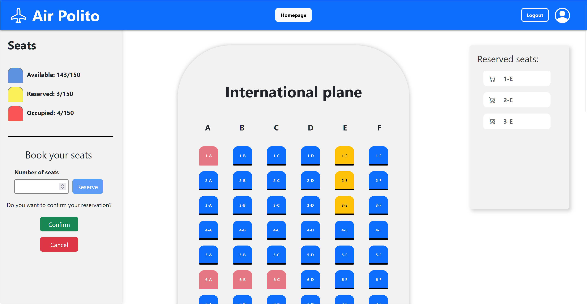

# "Airplane Seats"

## React Client Application Routes

- Route `/`: homepage of the application, contains three cards, one per plane type.
- Route `/login`: login page, contains a login box to allow a registered user to authenticate into the application
- Route `/local`: local airplane page, contains the local airplane seats grid and a sidebar that manages user actions if logged
- Route `/regional`: regional airplane page, contains the regional airplane seats grid and a sidebar that manages user actions if logged
- Route `/international`: international airplane page, contains the International airplane seats grid and a sidebar that manages user actions if logged
- Route `/*`: Generic route for URL mismatches, it routes to the homepage

## API Server

### Seats Management

- URL: `/api/seats`

  - HTTP method: `GET`
  - Parameters: `plane_id` is the id of the plane type
  - Description: gets the seats related to a specific plane type
  - Request body: _none_
  - Response body: unnamed array of seats objects

    ```JSON
    [
        {
        "id": 1,
        "row": 1,
        "line": "A",
        "plane_id": 1,
        "user_id": null
        },
        ...
    ]
    ```

  - Error responses: `500 Internal Server Error` (generic error)

- URL: `/api/check`

  - HTTP method: `GET`
  - Parameters: `seat_id` is the id of the seat to check
  - Description: used to check if a seat if available or not
  - Request body: _none_
  - Response body: object containing `user_id` value

    ```JSON
    {
        "user_id": null
    }
    ```

  - Error responses: `500 Internal Server Error` (generic error), `401 Unauthorized User` (user is not logged in)

- URL: `/api/reserve`

  - HTTP method: `PUT`
  - Parameters: _none_
  - Description: confirms the booking of a specific seat
  - Request body: `seat_id` is the id of the seat to book

    ```JSON
    {
        "seat_id": 2
    }
    ```

  - Response body: empty object
  - Error responses: `500 Internal Server Error` (generic error), `401 Unauthorized User` (user is not logged in)

- URL: `/api/delete`

  - HTTP method: `DELETE`
  - Parameters: _none_
  - Description: deletes the booking based on plane_type
  - Request body: `plane_id` is the id of the plane considered for deletion

    ```JSON
    {
        "plane_id": 3
    }
    ```

  - Response body: empty object
  - Error responses: `500 Internal Server Error` (generic error), `401 Unauthorized User` (user is not logged in)

### Plane Management

- URL: `/api/planes`:

  - HTTP method: `GET`
  - Parameters: _none_
  - Description: gets all planes information
  - Request body: _none_
  - Response body: unnamed array of plane objects

    ```JSON
    [
      {
        "id": 1,
        "type": "local",
        "rows": 15,
        "seats_per_row": 4,
        "tot_seats": 60
      },
      {
        "id": 2,
        "type": "regional",
        "rows": 20,
        "seats_per_row": 5,
        "tot_seats": 100
      },
      {
        "id": 3,
        "type": "international",
        "rows": 25,
        "seats_per_row": 6,
        "tot_seats": 150
      }
    ]
    ```

  - Error responses: `500 Internal Server Error` (generic error)

### User Authentication and Session Management

- URL: `/api/sessions`

  - HTTP method: `POST`
  - Description: authenticates the user who is trying to login
  - Request body: credentials of the user who is trying to login

    ```JSON
    {
        "email": "username",
        "password": "password"
    }
    ```

  - Response body: authenticated user

    ```JSON
    {
        "id": 1,
        "email": "mario.rossi@polito.it",
    }
    ```

  - Error responses: `500 Internal Server Error` (generic error), `401 Unauthorized User` (login failed)

- URL: `/api/sessions/current`

  - HTTP method: `GET`
  - Description: checks if current user is logged in and get her data
  - Request body: _none_
  - Response body: authenticated user

    ```JSON
    {
        "id": 1,
        "email": "mario.rossi@polito.it",
    }
    ```

  - Error responses: `500 Internal Server Error` (generic error), `401 Unauthorized User` (user is not logged in)

- URL: `/api/sessions/current`

  - HTTP method: `DELETE`
  - Description: logout current user
  - Request body: _none_
  - Response body: _none_
  - Error responses: `500 Internal Server Error` (generic error), `401 Unauthorized User` (user is not logged in)

## Database Tables

- `users`: it contains users credentials (email, hashed password and salt)
- `planes`: it contains planes information (plane type, number of rows, number of seats per row and total number of seats)
- `seats`: it contains seats information (row number, line letter, plane type and id of the user who booked the seat)

## Main React Components

- `HomePage` (in `HomePage.jsx`): it renders the homepage with three selectable cards, one for each plane type
- `LoginPage` (in `LoginPage.jsx`): shows and manages a login box to allow user to authenticate
- `PlaneView` (in `PlaneView.jsx`): it manages user actions on planes; it handles visualization in the case of both logged-in and non-logged-in user; in the first case it is also responsable of reservation, deletion, cancellation and confirmation of seat bookings
- `SeatsList` (in `SeatsList.jsx`): it shows a box containing the reserved seats, both manually and randomly, made by a logged-in user
- `Sidebar` (in `Sidebar.jsx`): it shows seats availability; it allows a logged-in user to randomly select available seats by inserting a number, to delete the reservation or to confirm it; it also allows a logged-in user to delete the seats bookiing

## Screenshot



## Users Credentials

| email                       | plain-text password |
| --------------------------- | ------------------- |
| mario.rossi@polito.it       | password            |
| giuseppe.verdi@polito.it    | password            |
| gualtiero.bianchi@polito.it | password            |
| tommaso.crociera@polito.it  | password            |
